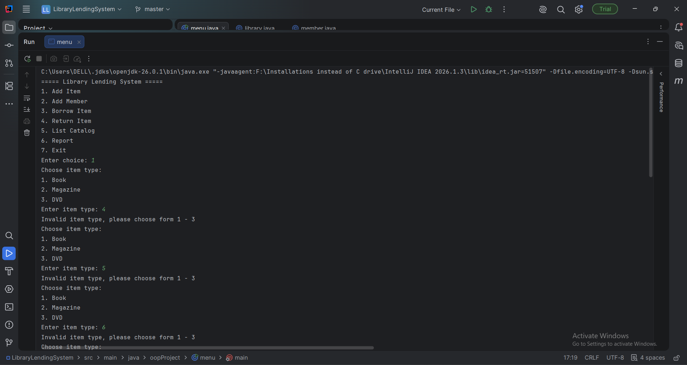

# Library Lending System

A menu-driven Java console application for managing a library catalog, registering members, and handling borrowing and returning of items.


## Project Overview
Java OOP Library System project featuring a menu-driven console application for managing library items, members, borrowing, and returning. Built using abstraction, inheritance, polymorphism, and exception handling with collections and input validation.
This project was built as a Java OOP assignment to demonstrate key object-oriented programming concepts in a practical library management system.

The library supports multiple item types:
- Book
- Magazine
- DVD

Each item type has its own borrowing period, but all items are handled through a shared base type, `LibraryItem`, using polymorphism.

## Features

- Add library items
- Add members
- Borrow items
- Return items
- List the full catalog
- Generate a report of library status
- Input validation for user entries
- Custom exception handling for library rule violations

## OOP Concepts Demonstrated

- Encapsulation
- Inheritance
- Abstraction
- Polymorphism
- Method overriding
- Constructors
- Static members
- Collections (`List`, `Map`, `Set`)
- Exception handling
- Input validation

## Classes

### `LibraryItem` (Abstract Class)
Base class for all library items.

### `Book`
Represents a book with author and page count.

### `Magazine`
Represents a magazine with issue number.

### `DVD`
Represents a DVD with runtime in minutes.

### `Member`
Represents a library member with a borrowing limit and borrowed items list.

### `LibraryException`
Custom exception used when library rules are broken.

### `Library`
Manages the catalog, members, borrowing, returning, and reports.

### `Main`
Provides the menu-driven console interface.

## Rules

- A member can only borrow up to their allowed limit.
- An item cannot be borrowed if it is already checked out.
- A member cannot return an item they did not borrow.
- Invalid actions are handled using exceptions so the program does not crash.

## How to Run

1. Compile the Java files:
   ```bash
   javac *.java
   ```

2. Run the program:
   ```bash
   java Main
   ```

## Example Menu

```text
===== Library Lending System =====
1. Add Item
2. Add Member
3. Borrow Item
4. Return Item
5. List Catalog
6. Report
7. Exit
```

## Sample Output

```text
ITEM-1 | Clean Code | Book | loan: 21 days | available
ITEM-2 | National Geographic | Magazine | loan: 7 days | OUT
```

## Project Structure

```text
LibraryLendingSystem/
├── Main.java
├── Library.java
├── LibraryItem.java
├── Book.java
├── Magazine.java
├── DVD.java
├── Member.java
└── LibraryException.java
```

## Notes

- Item IDs are generated automatically.
- The system uses polymorphism to manage all item types through the `LibraryItem` base class.
- Input errors and invalid operations are handled safely.

## License

This project is for educational purposes.
